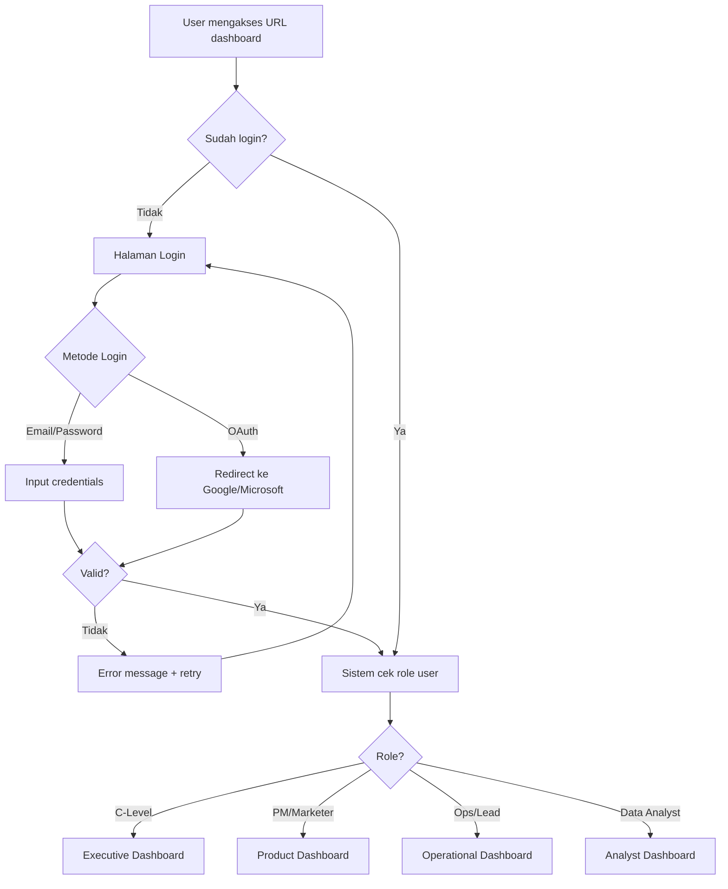
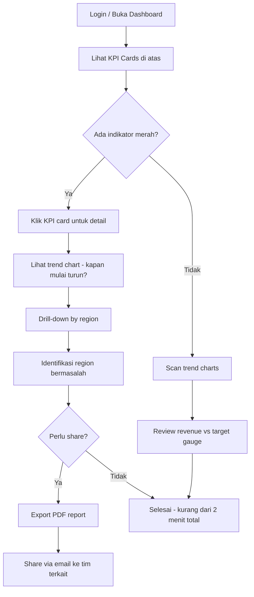
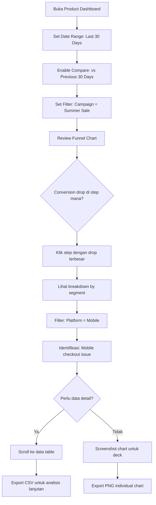
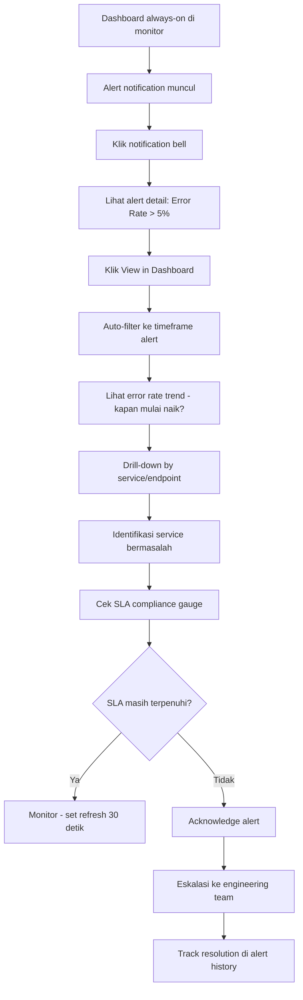
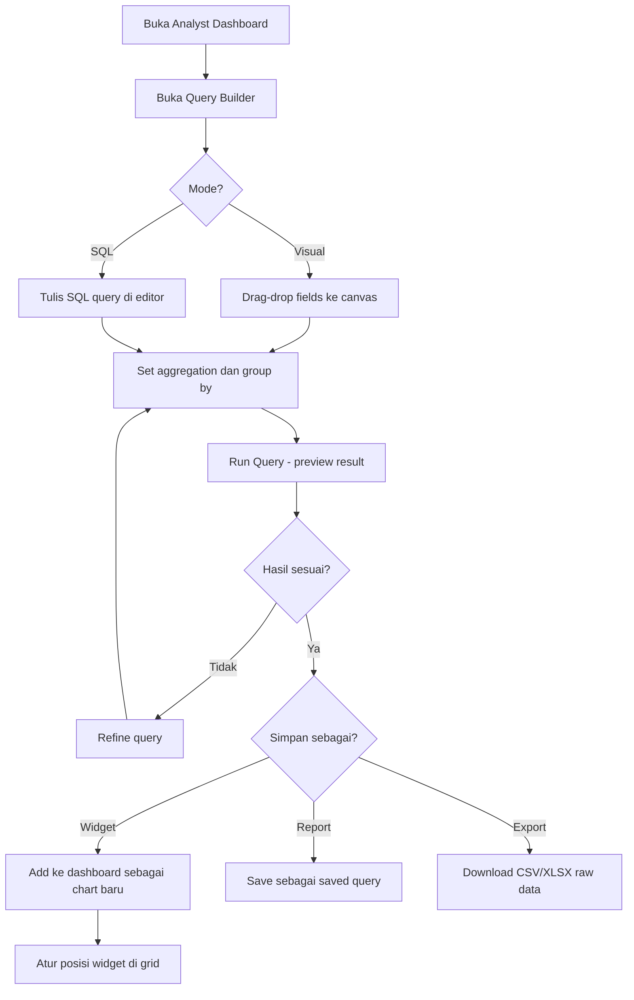
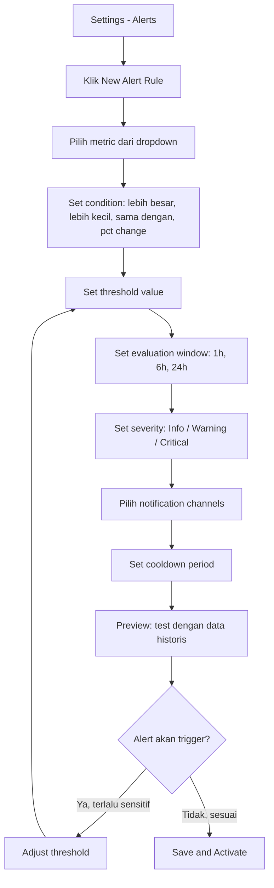
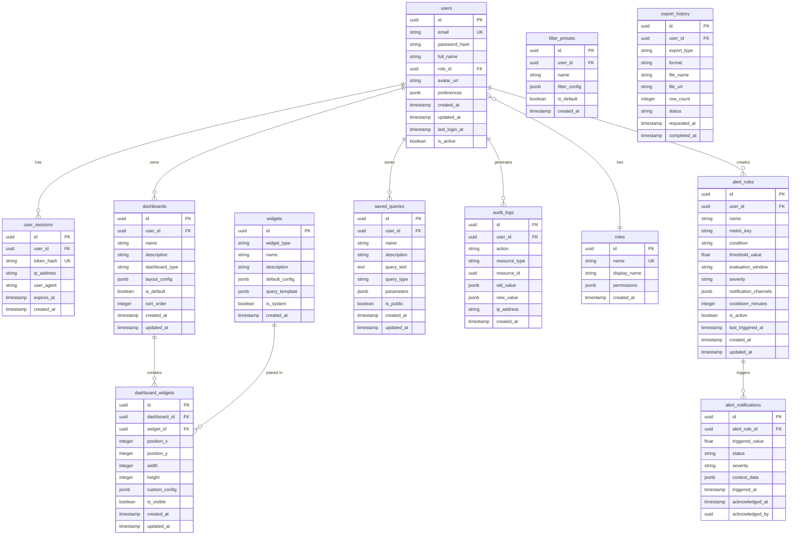
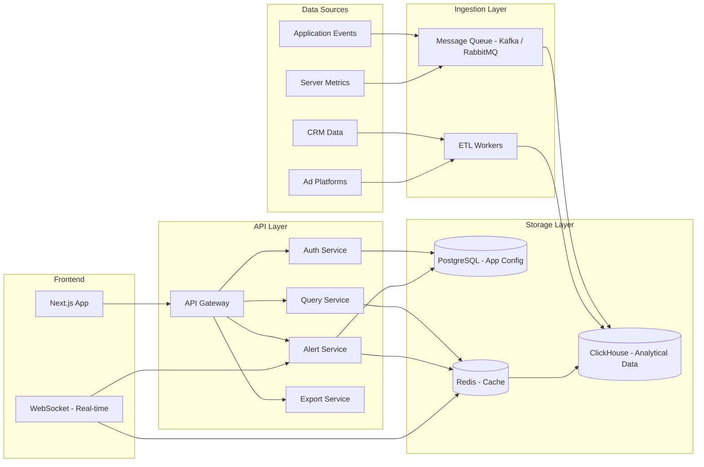
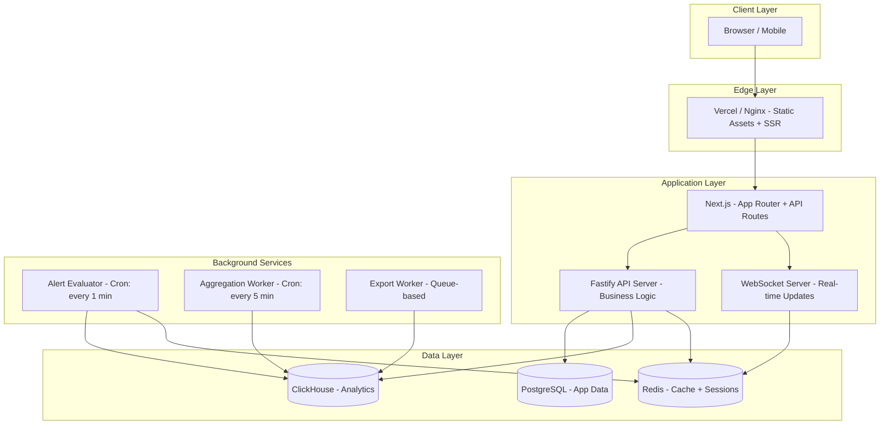

# 📊 PRD — Analytics Dashboard Platform

> *Unified analytics dashboard yang melayani seluruh lini organisasi — dari C-Level hingga Data Engineer — dengan pengalaman data yang cepat, intuitif, dan actionable.*

---

## Daftar Isi

1. [Goals & Objectives](#1-goals--objectives)
2. [Target Users & Persona](#2-target-users--persona)
3. [Fitur Lengkap](#3-fitur-lengkap)
4. [User Flow](#4-user-flow)
5. [UI/UX Design System](#5-uiux-design-system)
6. [Database Overview](#6-database-overview)
7. [Technical Requirements](#7-technical-requirements)
8. [Project Scope & Phasing](#8-project-scope--phasing)
9. [Risk & Mitigasi](#9-risk--mitigasi)
10. [Success Metrics](#10-success-metrics)

---

## 1. Goals & Objectives

### 1.1 Business Goals

| # | Goal | Deskripsi |
|---|------|-----------|
| BG-1 | **Unified Data Access** | Menyediakan satu platform terpusat untuk seluruh kebutuhan analytics organisasi, menggantikan spreadsheet manual dan laporan ad-hoc |
| BG-2 | **Accelerate Decision Making** | Mempercepat waktu dari "data tersedia" ke "keputusan diambil" (time-to-insight) |
| BG-3 | **Reduce Reporting Overhead** | Menghilangkan ketergantungan pada tim data untuk membuat laporan rutin — self-service analytics |
| BG-4 | **Proactive Monitoring** | Mendeteksi anomali dan threshold breach secara otomatis sebelum berdampak besar |
| BG-5 | **Data Democratization** | Memberdayakan setiap peran untuk mengakses data sesuai kebutuhan tanpa bottleneck |

### 1.2 User Goals (Per Persona)

| Persona | Goal Utama | Pain Point yang Diselesaikan |
|---------|------------|------------------------------|
| C-Level / Eksekutif | Melihat health bisnis dalam <30 detik | Tidak perlu menunggu laporan mingguan dari tim data |
| Product Manager & Marketer | Memahami user behavior dan mengukur campaign ROI | Tidak perlu request custom query ke data team |
| Operational / Team Lead | Monitoring real-time dan respon cepat terhadap anomali | Tidak perlu cek multiple tools untuk status operasional |
| Data Analyst / Engineer | Eksplorasi data fleksibel dan validasi hipotesis | Tidak terbatas pada pre-built dashboard saja |

### 1.3 Non-Goals (Apa yang BUKAN Tujuan)

- ❌ Menggantikan BI tool enterprise (Tableau, Looker) secara penuh
- ❌ Menjadi ETL/data pipeline tool
- ❌ Real-time streaming analytics sub-second (target: near real-time 1-5 menit)
- ❌ Machine Learning / predictive analytics (future consideration)

---

## 2. Target Users & Persona

### 2.1 Persona Detail

#### 👔 Persona A — C-Level / Eksekutif (CEO, CFO, CTO)

| Atribut | Detail |
|---------|--------|
| **Kebutuhan Data** | High-level KPI, tren jangka panjang (QoQ, YoY), dampak finansial |
| **Frekuensi Akses** | 1-3x per hari, biasanya pagi hari |
| **Device** | Desktop (kantor) + Tablet/Mobile (meeting, travel) |
| **Toleransi Kompleksitas** | Rendah — harus bisa dipahami dalam 10 detik |
| **Fitur Kunci** | KPI cards, trend lines, executive summary, PDF export |
| **Contoh Pertanyaan** | "Bagaimana revenue bulan ini vs bulan lalu?" / "Region mana yang underperform?" |

#### 📱 Persona B — Product Manager & Marketer

| Atribut | Detail |
|---------|--------|
| **Kebutuhan Data** | Funnel conversion, user retention, cohort analysis, campaign performance |
| **Frekuensi Akses** | 5-10x per hari |
| **Device** | Desktop (primary) |
| **Toleransi Kompleksitas** | Sedang — nyaman dengan filter dan segmentasi |
| **Fitur Kunci** | Segment filter, period comparison, funnel charts, cohort tables |
| **Contoh Pertanyaan** | "Berapa conversion rate signup-to-purchase untuk user dari campaign X?" |

#### ⚙️ Persona C — Operational / Team Lead

| Atribut | Detail |
|---------|--------|
| **Kebutuhan Data** | Metrik harian/real-time, SLA compliance, ticket queue, anomaly alerts |
| **Frekuensi Akses** | Always-on (dashboard di layar kedua) |
| **Device** | Desktop + TV display (war room) |
| **Toleransi Kompleksitas** | Sedang — fokus pada status dan threshold |
| **Fitur Kunci** | Real-time refresh, alert badges, SLA gauges, status indicators |
| **Contoh Pertanyaan** | "Berapa tiket yang belum direspon >2 jam?" / "Apakah server load normal?" |

#### 🔬 Persona D — Data Analyst / Engineer

| Atribut | Detail |
|---------|--------|
| **Kebutuhan Data** | Raw data access, custom aggregation, correlation analysis |
| **Frekuensi Akses** | 10-20x per hari |
| **Device** | Desktop (multi-monitor) |
| **Toleransi Kompleksitas** | Tinggi — nyaman dengan SQL-like query |
| **Fitur Kunci** | Query builder, raw data table, CSV/XLSX export, API access |
| **Contoh Pertanyaan** | "Korelasi antara response time dan churn rate per cohort?" |

### 2.2 Role-Based Access Matrix

| Fitur | C-Level | PM/Marketer | Ops/Lead | Data Analyst | Admin |
|-------|:-------:|:-----------:|:--------:|:------------:|:-----:|
| View Executive Dashboard | ✅ | ✅ | ❌ | ✅ | ✅ |
| View Product/Marketing Dashboard | ❌ | ✅ | ❌ | ✅ | ✅ |
| View Operational Dashboard | ❌ | ❌ | ✅ | ✅ | ✅ |
| Query Builder / Raw Data | ❌ | ❌ | ❌ | ✅ | ✅ |
| Configure Alerts | ❌ | ✅ | ✅ | ✅ | ✅ |
| Export Data (CSV/XLSX) | ✅ | ✅ | ✅ | ✅ | ✅ |
| Export Report (PDF/PNG) | ✅ | ✅ | ✅ | ✅ | ✅ |
| Customize Widget Layout | ✅ | ✅ | ✅ | ✅ | ✅ |
| Manage Users & Roles | ❌ | ❌ | ❌ | ❌ | ✅ |
| Manage Data Sources | ❌ | ❌ | ❌ | ✅ | ✅ |

---

## 3. Fitur Lengkap

### 3.1 Feature Map (Prioritas)

> **P0** = Must-have MVP · **P1** = Should-have (Phase 2) · **P2** = Nice-to-have (Phase 3)

---

#### 🏷️ F-01: Authentication & Authorization (P0)

| Item | Detail |
|------|--------|
| **Deskripsi** | Login system dengan role-based access control (RBAC) |
| **Detail** | Email/password login, OAuth2 (Google, Microsoft), session management, JWT tokens |
| **Role Mapping** | Setiap user memiliki 1 role utama yang menentukan default dashboard dan akses fitur |
| **Acceptance Criteria** | User bisa login, melihat dashboard sesuai role, tidak bisa akses halaman di luar permission |

---

#### 🏷️ F-02: Global Filter & Date Picker (P0)

| Item | Detail |
|------|--------|
| **Deskripsi** | Filter bar persisten di atas setiap halaman dashboard |
| **Komponen** | Date Range Picker (preset: Today, Last 7d, Last 30d, Custom), Compare Period toggle, Attribute Filters (region, platform, tier, campaign) |
| **Behavior** | Mengubah filter langsung memperbarui SEMUA widget di halaman tersebut secara reaktif |
| **Acceptance Criteria** | Filter perubahan ter-reflect di semua chart dalam <500ms (cached) atau <3s (cold query) |

**Detail Date Range Picker:**
```
┌──────────────────────────────────────────────────────┐
│  📅 Date Range: [Last 7 Days ▾]  🔄 vs Previous Period │
│  🌍 Region: [All ▾]  📱 Platform: [All ▾]  👤 Tier: [All ▾] │
└──────────────────────────────────────────────────────┘
```

Preset options:
- Today
- Yesterday
- Last 7 Days
- Last 30 Days
- This Month
- Last Month
- This Quarter
- Last Quarter
- Year to Date
- Custom Range (calendar picker)

---

#### 🏷️ F-03: KPI Summary Cards (P0)

| Item | Detail |
|------|--------|
| **Deskripsi** | Baris kartu ringkasan di bagian atas dashboard menampilkan metrik utama |
| **Komponen per Card** | Metric label, Current value (angka besar), Delta vs previous period (% dengan warna hijau/merah), Sparkline mini-chart (7 hari terakhir) |
| **Jumlah Cards** | 4-6 per dashboard view, disesuaikan per persona |
| **Responsive** | 4 kolom di desktop, 2 kolom di tablet, 1 kolom di mobile |

**KPI Cards per Persona:**

| Persona | Card 1 | Card 2 | Card 3 | Card 4 | Card 5 |
|---------|--------|--------|--------|--------|--------|
| C-Level | Total Revenue | Active Users | Customer Acquisition Cost | Net Promoter Score | Gross Margin |
| PM/Marketing | DAU/MAU Ratio | Conversion Rate | Avg Session Duration | Campaign ROI | Churn Rate |
| Ops/Lead | Open Tickets | Avg Response Time | SLA Compliance % | Server Uptime | Error Rate |
| Data Analyst | Query Count | Data Freshness | Pipeline Success Rate | Storage Usage | API Latency |

---

#### 🏷️ F-04: Chart Visualizations (P0)

| Item | Detail |
|------|--------|
| **Deskripsi** | Koleksi chart interaktif untuk visualisasi data |
| **Tipe Chart** | Line Chart (trend), Bar Chart (comparison), Donut/Pie Chart (composition, max 5 segments), Area Chart (volume over time), Stacked Bar (breakdown), Gauge (SLA/target) |
| **Interaksi** | Hover → tooltip detail, Click → drill-down filter, Zoom → time range selection pada line/area chart |
| **Responsive** | Chart resize otomatis sesuai container, legend collapse di mobile |

**Chart Specifications:**

```
Line Chart
├── X-axis: Time (auto-granularity: hourly/daily/weekly/monthly)
├── Y-axis: Metric value (auto-scale)
├── Tooltip: Date, Value, Delta vs previous
├── Legend: Toggle series visibility
└── Interaction: Click data point → drill-down

Bar Chart
├── X-axis: Category (region, campaign, product)
├── Y-axis: Metric value
├── Tooltip: Category, Value, % of total
├── Sorting: By value (desc) atau alphabetical
└── Interaction: Click bar → filter dashboard by category

Donut Chart
├── Max segments: 5 (sisanya grouped sebagai "Others")
├── Center label: Total value
├── Tooltip: Segment name, Value, Percentage
└── Interaction: Click segment → filter dashboard
```

---

#### 🏷️ F-05: Drill-Down / Click-to-Filter (P0)

| Item | Detail |
|------|--------|
| **Deskripsi** | Interaksi klik pada chart element untuk memfilter seluruh dashboard |
| **Behavior** | Klik bar/segment/data point → active filter badge muncul di global filter bar → semua widget lain ter-update |
| **Breadcrumb** | Tampilkan drill-down path: "All Regions > Asia Pacific > Indonesia" |
| **Reset** | Tombol "Clear All Filters" atau klik breadcrumb untuk navigasi mundur |
| **Acceptance Criteria** | Drill-down transition <300ms, filter state tersimpan di URL (shareable) |

---

#### 🏷️ F-06: Data Table with Search & Sort (P0)

| Item | Detail |
|------|--------|
| **Deskripsi** | Tabel data interaktif di bagian bawah dashboard |
| **Fitur** | Column sorting (asc/desc), Full-text search, Pagination (25/50/100 rows), Column visibility toggle, Row click → detail panel |
| **Performance** | Virtual scrolling untuk dataset >1000 rows |
| **Export** | Tombol export langsung dari tabel (CSV, XLSX) |

---

#### 🏷️ F-07: Alerts & Threshold Notifications (P0)

| Item | Detail |
|------|--------|
| **Deskripsi** | Sistem alert otomatis saat metrik melampaui threshold |
| **Konfigurasi Alert** | Metric selection, Condition (>, <, =, % change), Threshold value, Severity (Info, Warning, Critical), Notification channel (In-app, Email, Slack webhook) |
| **Visual Indicators** | Badge merah pada KPI card, Flashing border pada widget terkait, Bell icon notification center dengan badge count |
| **Alert History** | Log seluruh triggered alerts dengan timestamp, value, dan status (active/acknowledged/resolved) |

**Alert Rule Example:**
```
Rule: "High Bounce Rate Alert"
├── Metric: Bounce Rate
├── Condition: > 65%
├── Window: Last 1 Hour
├── Severity: Warning
├── Notify: In-app + Slack #ops-alerts
└── Cooldown: 30 minutes (prevent spam)
```

---

#### 🏷️ F-08: Export & Sharing (P1)

| Item | Detail |
|------|--------|
| **Deskripsi** | Kemampuan export data dan report dalam berbagai format |
| **Data Export** | CSV (raw data), XLSX (formatted with headers), JSON (API-friendly) |
| **Report Export** | PDF (full dashboard snapshot), PNG (individual chart) |
| **Sharing** | Shareable link dengan filter state encoded di URL, Scheduled email report (daily/weekly/monthly) |
| **Limits** | Max export: 100K rows (CSV), 50K rows (XLSX), PDF max 20 pages |

---

#### 🏷️ F-09: Widget Customization & Drag-and-Drop (P1)

| Item | Detail |
|------|--------|
| **Deskripsi** | User bisa mengatur layout dashboard sesuai preferensi |
| **Fitur** | Drag-and-drop widget reordering, Resize widget (small/medium/large), Hide/show widget, Save layout per user, Reset to default layout |
| **Grid System** | 12-column grid, widget snap-to-grid |
| **Persistence** | Layout tersimpan per user di database, sync across devices |

---

#### 🏷️ F-10: Query Builder (P1)

| Item | Detail |
|------|--------|
| **Deskripsi** | Interface visual untuk Data Analyst membuat custom query |
| **Komponen** | Visual query builder (drag-drop fields), SQL editor (raw mode), Result preview (live), Save query sebagai widget atau report |
| **Safety** | Query timeout: 30 detik, Read-only access, Row limit: 10K preview |
| **Target User** | Data Analyst / Engineer only |

---

#### 🏷️ F-11: Multi-Dashboard Support (P1)

| Item | Detail |
|------|--------|
| **Deskripsi** | User bisa memiliki multiple dashboard dengan fokus berbeda |
| **Fitur** | Create/rename/delete dashboard, Clone existing dashboard, Set default dashboard per login, Tab navigation antar dashboard |
| **Limits** | Max 10 dashboards per user, Max 20 widgets per dashboard |

---

#### 🏷️ F-12: Real-Time Data Refresh (P1)

| Item | Detail |
|------|--------|
| **Deskripsi** | Auto-refresh data untuk dashboard operasional |
| **Interval Options** | 30 detik, 1 menit, 5 menit, 15 menit, Manual |
| **Indicator** | "Last updated: 30s ago" badge, Subtle pulse animation saat data refresh |
| **Implementation** | WebSocket untuk real-time, polling fallback |

---

#### 🏷️ F-13: Annotation & Comments (P2)

| Item | Detail |
|------|--------|
| **Deskripsi** | Kemampuan menambahkan catatan pada data point tertentu |
| **Fitur** | Click data point → add annotation, Annotation visible as marker on chart, Comment thread per annotation |
| **Use Case** | "Revenue drop on June 5 = server outage" |

---

#### 🏷️ F-14: Favorites & Quick Access (P2)

| Item | Detail |
|------|--------|
| **Deskripsi** | Bookmark dashboard, chart, atau saved query untuk akses cepat |
| **Fitur** | Star/favorite dashboard, Recent items list, Quick search (Cmd+K) |

---

#### 🏷️ F-15: Audit Log (P0)

| Item | Detail |
|------|--------|
| **Deskripsi** | Logging seluruh aktivitas user untuk compliance dan security |
| **Events Logged** | Login/logout, Data export, Alert configuration changes, Dashboard sharing, Query execution |
| **Retention** | 90 hari default, configurable |

---

### 3.2 Feature Priority Matrix

```
           High Impact
               │
    ┌──────────┼──────────┐
    │  P1      │  P0      │
    │          │          │
    │ F-09     │ F-01     │
    │ F-10     │ F-02     │
    │ F-11     │ F-03     │
    │ F-12     │ F-04     │
    │          │ F-05     │
    │          │ F-06     │
    │          │ F-07     │
────┼──────────┼──────────┼──── High Effort
    │  P2      │ F-08     │
    │          │ F-15     │
    │ F-13     │          │
    │ F-14     │          │
    │          │          │
    └──────────┼──────────┘
               │
           Low Impact
```

---

## 4. User Flow

### 4.1 Flow Umum — First-Time Login



### 4.2 Flow C-Level — Morning Review



### 4.3 Flow PM/Marketer — Campaign Analysis



### 4.4 Flow Ops/Team Lead — Incident Response



### 4.5 Flow Data Analyst — Ad-hoc Analysis



### 4.6 Flow Alert Configuration



---

## 5. UI/UX Design System

### 5.1 Design Principles

| Prinsip | Implementasi |
|---------|-------------|
| **Visual Hierarchy (Z/F Pattern)** | KPI cards atas-kiri → trend chart tengah → data table bawah |
| **Functional Color** | Netral untuk chrome, aksen untuk data, hijau/merah hanya untuk delta |
| **High Data-to-Ink Ratio** | Minimal border, no 3D effects, clean whitespace |
| **Progressive Disclosure** | Tampilkan summary dulu, detail on-demand (hover/click) |
| **Consistent Feedback** | Skeleton loader, empty state, error state untuk setiap widget |

### 5.2 Color System

```
┌─────────────────────────────────────────────────────────┐
│  BACKGROUND & SURFACE                                    │
│  ─────────────────────                                   │
│  Page Background:    #F8FAFC  (Slate 50)                │
│  Card Surface:       #FFFFFF  (White)                    │
│  Card Border:        #E2E8F0  (Slate 200)               │
│  Sidebar Background: #0F172A  (Slate 900)               │
│                                                          │
│  TEXT                                                    │
│  ────                                                    │
│  Primary Text:       #0F172A  (Slate 900)               │
│  Secondary Text:     #64748B  (Slate 500)               │
│  Muted Text:         #94A3B8  (Slate 400)               │
│                                                          │
│  BRAND & ACCENT                                          │
│  ──────────────                                          │
│  Primary Accent:     #3B82F6  (Blue 500)                │
│  Primary Hover:      #2563EB  (Blue 600)                │
│  Secondary Accent:   #8B5CF6  (Violet 500)              │
│                                                          │
│  DATA VISUALIZATION                                      │
│  ──────────────────                                      │
│  Series 1:           #3B82F6  (Blue)                    │
│  Series 2:           #8B5CF6  (Violet)                  │
│  Series 3:           #06B6D4  (Cyan)                    │
│  Series 4:           #F59E0B  (Amber)                   │
│  Series 5:           #EC4899  (Pink)                    │
│                                                          │
│  SEMANTIC                                                │
│  ────────                                                │
│  Positive / Up:      #22C55E  (Green 500)               │
│  Negative / Down:    #EF4444  (Red 500)                 │
│  Warning:            #F59E0B  (Amber 500)               │
│  Info:               #3B82F6  (Blue 500)                │
│  Neutral Delta:      #64748B  (Slate 500)               │
└─────────────────────────────────────────────────────────┘
```

### 5.3 Typography

| Element | Font | Size | Weight | Color |
|---------|------|------|--------|-------|
| Page Title | Inter | 24px / 1.5rem | 700 (Bold) | Slate 900 |
| Section Header | Inter | 18px / 1.125rem | 600 (Semi) | Slate 900 |
| Widget Title | Inter | 14px / 0.875rem | 600 (Semi) | Slate 700 |
| KPI Value (Big Number) | Inter / Tabular | 32px / 2rem | 700 (Bold) | Slate 900 |
| KPI Delta | Inter | 14px / 0.875rem | 500 (Medium) | Green/Red |
| Body Text | Inter | 14px / 0.875rem | 400 (Regular) | Slate 700 |
| Table Header | Inter | 12px / 0.75rem | 600 (Semi) | Slate 500 |
| Table Cell | Inter / Tabular | 14px / 0.875rem | 400 (Regular) | Slate 700 |
| Caption / Label | Inter | 12px / 0.75rem | 500 (Medium) | Slate 400 |

> ⚠️ **Gunakan `font-variant-numeric: tabular-nums`** untuk semua angka agar digit rata dan mudah di-scan secara vertikal.

### 5.4 Layout Structure

```
┌─────────────────────────────────────────────────────────────────┐
│ ┌─────┐  ┌───────────────────────────────────────────────────┐  │
│ │     │  │  HEADER BAR                                       │  │
│ │     │  │  [Logo] [Dashboard Title]    [🔔 3] [👤 User ▾]  │  │
│ │     │  └───────────────────────────────────────────────────┘  │
│ │     │  ┌───────────────────────────────────────────────────┐  │
│ │  S  │  │  GLOBAL FILTER BAR                                │  │
│ │  I  │  │  [📅 Last 7 Days ▾] [🔄 vs Prev] [🌍 Region ▾]  │  │
│ │  D  │  │  [📱 Platform ▾] [👤 Tier ▾]  [✕ Clear Filters]  │  │
│ │  E  │  └───────────────────────────────────────────────────┘  │
│ │  B  │  ┌────────┐ ┌────────┐ ┌────────┐ ┌────────┐          │
│ │  A  │  │ KPI 1  │ │ KPI 2  │ │ KPI 3  │ │ KPI 4  │          │
│ │  R  │  │ ▲ +12% │ │ ▼ -3%  │ │ ▲ +5%  │ │ ● 0%   │          │
│ │     │  └────────┘ └────────┘ └────────┘ └────────┘          │
│ │ Nav │  ┌──────────────────────┐ ┌──────────────────┐         │
│ │     │  │                      │ │                  │         │
│ │ 📊  │  │   MAIN TREND CHART   │ │   DONUT / BAR    │         │
│ │ 📈  │  │   (Line / Area)      │ │   (Composition)  │         │
│ │ ⚙️  │  │                      │ │                  │         │
│ │ 🔔  │  └──────────────────────┘ └──────────────────┘         │
│ │ 👤  │  ┌──────────────────────┐ ┌──────────────────┐         │
│ │     │  │                      │ │                  │         │
│ │     │  │   SECONDARY CHART    │ │  GAUGE / STATUS  │         │
│ │     │  │                      │ │                  │         │
│ │     │  └──────────────────────┘ └──────────────────┘         │
│ │     │  ┌─────────────────────────────────────────────┐       │
│ │     │  │  DATA TABLE                                  │       │
│ │     │  │  [🔍 Search] [Columns ▾] [Export ▾]         │       │
│ │     │  │  ┌──────┬──────┬──────┬──────┬──────┐       │       │
│ │     │  │  │ Col1 │ Col2 │ Col3 │ Col4 │ Col5 │       │       │
│ │     │  │  ├──────┼──────┼──────┼──────┼──────┤       │       │
│ │     │  │  │      │      │      │      │      │       │       │
│ │     │  │  └──────┴──────┴──────┴──────┴──────┘       │       │
│ │     │  └─────────────────────────────────────────────┘       │
│ └─────┘                                                         │
└─────────────────────────────────────────────────────────────────┘
```

### 5.5 Responsive Breakpoints

| Breakpoint | Width | Layout |
|------------|-------|--------|
| Desktop XL | ≥1440px | Sidebar expanded + 12-column grid |
| Desktop | ≥1024px | Sidebar expanded + 8-column grid |
| Tablet | ≥768px | Sidebar collapsed (icon-only) + 4-column grid |
| Mobile | <768px | Bottom navigation + 1-column stack |

### 5.6 Component States

Setiap widget/komponen HARUS memiliki state berikut:

| State | Visual |
|-------|--------|
| **Loading** | Skeleton placeholder (animated shimmer), ukuran sesuai expected content |
| **Loaded** | Data ditampilkan normal |
| **Empty** | Ilustrasi + "No data available for selected filters" + suggestion |
| **Error** | Error icon + message + "Retry" button |
| **Refreshing** | Subtle opacity pulse (0.7 → 1.0) tanpa skeleton, data lama tetap visible |

### 5.7 Micro-interactions

| Interaction | Animation |
|-------------|-----------|
| Widget load | Fade-in + slight slide-up (200ms ease-out) |
| Chart hover | Crosshair + tooltip fade-in (100ms) |
| Filter change | Widget content cross-fade (150ms) |
| KPI delta | Number count-up animation (400ms) |
| Alert badge | Pulse animation (infinite, subtle) |
| Drag widget | Lift shadow + slight scale (1.02) |
| Button click | Scale down (0.97) + release (100ms) |
| Sidebar toggle | Width transition (200ms ease) |

### 5.8 Sidebar Navigation

```
┌──────────────────────┐
│  🟦 DASH ANALYTICS   │
│                      │
│  📊 Dashboard        │  ← Current page highlight
│     ├── Executive    │
│     ├── Product      │
│     ├── Operations   │
│     └── Custom       │
│                      │
│  🔍 Query Builder    │
│  🔔 Alerts           │
│     └── (3 active)   │  ← Badge count
│  📁 Saved Reports    │
│  📤 Exports          │
│                      │
│  ─────────────────   │
│  ⚙️ Settings         │
│  ❓ Help & Docs      │
│                      │
│  ┌──────────────┐    │
│  │ 👤 Ridho     │    │
│  │ Admin        │    │
│  │ [Logout]     │    │
│  └──────────────┘    │
└──────────────────────┘
```

---

## 6. Database Overview

### 6.1 Database Strategy

Platform ini menggunakan **dual-database architecture**:

| Database | Engine | Purpose |
|----------|--------|---------|
| **Primary (Application DB)** | PostgreSQL 16 | User management, dashboard config, alerts, audit logs |
| **Analytical DB** | ClickHouse | Time-series metric data, event data, pre-aggregated tables |
| **Cache Layer** | Redis 7 | Query result caching, session storage, real-time counters |

### 6.2 PostgreSQL Schema — Application Database

#### Entity Relationship Diagram



#### Table Details

**`users`**
```sql
CREATE TABLE users (
    id           UUID PRIMARY KEY DEFAULT gen_random_uuid(),
    email        VARCHAR(255) NOT NULL UNIQUE,
    password_hash VARCHAR(255),                     -- NULL jika OAuth-only
    full_name    VARCHAR(255) NOT NULL,
    role_id      UUID NOT NULL REFERENCES roles(id),
    avatar_url   VARCHAR(500),
    preferences  JSONB DEFAULT '{}',                -- theme, language, timezone
    is_active    BOOLEAN DEFAULT true,
    created_at   TIMESTAMPTZ DEFAULT now(),
    updated_at   TIMESTAMPTZ DEFAULT now(),
    last_login_at TIMESTAMPTZ
);
```

**`roles`**
```sql
CREATE TABLE roles (
    id           UUID PRIMARY KEY DEFAULT gen_random_uuid(),
    name         VARCHAR(50) NOT NULL UNIQUE,       -- 'c_level', 'product_manager', 'ops_lead', 'data_analyst', 'admin'
    display_name VARCHAR(100) NOT NULL,
    permissions  JSONB NOT NULL DEFAULT '{}',       -- {"dashboards": ["exec", "product"], "features": ["export", "alerts"]}
    created_at   TIMESTAMPTZ DEFAULT now()
);
```

**`dashboards`**
```sql
CREATE TABLE dashboards (
    id              UUID PRIMARY KEY DEFAULT gen_random_uuid(),
    user_id         UUID NOT NULL REFERENCES users(id) ON DELETE CASCADE,
    name            VARCHAR(255) NOT NULL,
    description     TEXT,
    dashboard_type  VARCHAR(50) NOT NULL,            -- 'executive', 'product', 'operations', 'analyst', 'custom'
    layout_config   JSONB DEFAULT '{}',              -- grid layout positions
    is_default      BOOLEAN DEFAULT false,
    sort_order      INTEGER DEFAULT 0,
    created_at      TIMESTAMPTZ DEFAULT now(),
    updated_at      TIMESTAMPTZ DEFAULT now()
);
```

**`alert_rules`**
```sql
CREATE TABLE alert_rules (
    id                   UUID PRIMARY KEY DEFAULT gen_random_uuid(),
    user_id              UUID NOT NULL REFERENCES users(id) ON DELETE CASCADE,
    name                 VARCHAR(255) NOT NULL,
    metric_key           VARCHAR(100) NOT NULL,       -- 'bounce_rate', 'error_rate', 'revenue'
    condition            VARCHAR(20) NOT NULL,         -- 'gt', 'lt', 'eq', 'pct_change_gt', 'pct_change_lt'
    threshold_value      DOUBLE PRECISION NOT NULL,
    evaluation_window    VARCHAR(20) NOT NULL,         -- '1h', '6h', '24h', '7d'
    severity             VARCHAR(20) NOT NULL DEFAULT 'warning',
    notification_channels JSONB NOT NULL DEFAULT '["in_app"]',
    cooldown_minutes     INTEGER DEFAULT 30,
    is_active            BOOLEAN DEFAULT true,
    last_triggered_at    TIMESTAMPTZ,
    created_at           TIMESTAMPTZ DEFAULT now(),
    updated_at           TIMESTAMPTZ DEFAULT now()
);
```

### 6.3 ClickHouse Schema — Analytical Database

#### Raw Events Table
```sql
CREATE TABLE events (
    event_id       UUID,
    event_type     LowCardinality(String),    -- 'page_view', 'click', 'purchase', 'signup'
    user_id        UUID,
    session_id     UUID,
    timestamp      DateTime64(3),              -- millisecond precision
    properties     String,                     -- JSON string for flexible schema

    -- Common dimensions (denormalized for query speed)
    region         LowCardinality(String),
    platform       LowCardinality(String),     -- 'web', 'ios', 'android'
    account_tier   LowCardinality(String),     -- 'free', 'pro', 'enterprise'
    campaign       LowCardinality(String),

    -- Common metrics
    revenue        Decimal64(2) DEFAULT 0,
    duration_ms    UInt32 DEFAULT 0
)
ENGINE = MergeTree()
PARTITION BY toYYYYMM(timestamp)
ORDER BY (event_type, timestamp, user_id)
TTL timestamp + INTERVAL 24 MONTH;
```

#### Pre-Aggregated: Hourly Metrics
```sql
CREATE TABLE metrics_hourly (
    metric_key     LowCardinality(String),     -- 'active_users', 'revenue', 'page_views'
    hour           DateTime,
    region         LowCardinality(String),
    platform       LowCardinality(String),
    account_tier   LowCardinality(String),

    value_sum      Float64 DEFAULT 0,
    value_count    UInt64 DEFAULT 0,
    value_avg      Float64 DEFAULT 0,
    value_min      Float64 DEFAULT 0,
    value_max      Float64 DEFAULT 0,
    unique_users   AggregateFunction(uniq, UUID)
)
ENGINE = SummingMergeTree()
PARTITION BY toYYYYMM(hour)
ORDER BY (metric_key, hour, region, platform, account_tier);
```

#### Pre-Aggregated: Daily Metrics
```sql
CREATE TABLE metrics_daily (
    metric_key     LowCardinality(String),
    date           Date,
    region         LowCardinality(String),
    platform       LowCardinality(String),
    account_tier   LowCardinality(String),

    value_sum      Float64 DEFAULT 0,
    value_count    UInt64 DEFAULT 0,
    value_avg      Float64 DEFAULT 0,
    value_min      Float64 DEFAULT 0,
    value_max      Float64 DEFAULT 0,
    unique_users   AggregateFunction(uniq, UUID)
)
ENGINE = SummingMergeTree()
PARTITION BY toYYYYMM(date)
ORDER BY (metric_key, date, region, platform, account_tier);
```

#### Funnel Analysis Table
```sql
CREATE TABLE funnel_events (
    funnel_id      LowCardinality(String),     -- 'signup_to_purchase', 'onboarding'
    step_order     UInt8,
    step_name      LowCardinality(String),
    user_id        UUID,
    session_id     UUID,
    timestamp      DateTime64(3),
    region         LowCardinality(String),
    platform       LowCardinality(String),
    campaign       LowCardinality(String)
)
ENGINE = MergeTree()
PARTITION BY toYYYYMM(timestamp)
ORDER BY (funnel_id, step_order, timestamp, user_id);
```

#### Materialized View: Automatic Aggregation

```sql
-- Auto-aggregate dari events ke metrics_hourly
CREATE MATERIALIZED VIEW mv_events_to_hourly
TO metrics_hourly
AS
SELECT
    event_type AS metric_key,
    toStartOfHour(timestamp) AS hour,
    region,
    platform,
    account_tier,
    sum(revenue) AS value_sum,
    count() AS value_count,
    avg(duration_ms) AS value_avg,
    min(duration_ms) AS value_min,
    max(duration_ms) AS value_max,
    uniqState(user_id) AS unique_users
FROM events
GROUP BY metric_key, hour, region, platform, account_tier;
```

### 6.4 Redis Schema — Cache Layer

| Key Pattern | Value Type | TTL | Purpose |
|-------------|-----------|-----|---------|
| `session:{token}` | Hash | 24h | User session data |
| `dashboard:{user_id}:{dashboard_id}` | JSON String | 5min | Cached dashboard query results |
| `kpi:{metric_key}:{date_range}:{filters_hash}` | JSON String | 1-5min | Cached KPI values |
| `alert:active:{alert_id}` | Hash | - | Currently active alert state |
| `rate_limit:{user_id}:export` | Counter | 1h | Export rate limiting |
| `realtime:{metric_key}` | Sorted Set | 1h | Real-time metric buffer |

### 6.5 Data Flow Architecture



---

## 7. Technical Requirements

### 7.1 Tech Stack (Final)

| Layer | Technology | Versi | Justifikasi |
|-------|-----------|-------|-------------|
| **Frontend** | Next.js (React 18+) | 14.x | SSR/SSG, App Router, excellent DX |
| **UI Framework** | Tailwind CSS + Shadcn/UI | 3.x / latest | Utility-first, copy-paste components, highly customizable |
| **Charts** | Recharts + Tremor | 2.x / latest | React-native charts, declarative API, responsive |
| **State Management** | Zustand + TanStack Query | 4.x / 5.x | Lightweight global state + powerful server state cache |
| **Backend** | Node.js (Fastify) | 22 LTS / 5.x | Fast HTTP framework, schema validation, plugin ecosystem |
| **API Style** | REST + WebSocket | - | REST untuk CRUD, WebSocket untuk real-time updates |
| **Auth** | NextAuth.js (Auth.js) | 5.x | Multi-provider OAuth + credentials, JWT |
| **App Database** | PostgreSQL | 16.x | Relational, JSONB support, mature ecosystem |
| **Analytical DB** | ClickHouse | 24.x | Columnar, blazing fast aggregations on billions of rows |
| **Cache** | Redis | 7.x | In-memory cache, pub/sub for real-time, session store |
| **ORM** | Drizzle ORM | latest | Type-safe, lightweight, SQL-like API |
| **Validation** | Zod | 3.x | Schema validation shared between frontend and backend |
| **Testing** | Vitest + Playwright | latest | Unit/integration tests + E2E browser tests |
| **Deployment** | Docker + Docker Compose | - | Containerized deployment, environment parity |
| **CI/CD** | GitHub Actions | - | Automated testing, building, deployment |

### 7.2 Architecture Overview



### 7.3 API Design

#### Base URL
```
Production:  https://api.dashboard.example.com/v1
Development: http://localhost:3001/v1
```

#### Core Endpoints

**Authentication**
```
POST   /auth/login              → Login (email/password)
POST   /auth/oauth/{provider}   → OAuth callback
POST   /auth/logout             → Logout
GET    /auth/me                 → Get current user profile
POST   /auth/refresh            → Refresh JWT token
```

**Dashboards**
```
GET    /dashboards              → List user's dashboards
POST   /dashboards              → Create new dashboard
GET    /dashboards/:id          → Get dashboard with widgets
PUT    /dashboards/:id          → Update dashboard (name, layout)
DELETE /dashboards/:id          → Delete dashboard
PUT    /dashboards/:id/layout   → Update widget layout (drag-drop)
```

**Metrics & Data**
```
GET    /metrics/kpi             → Get KPI summary cards
       ?metrics=revenue,active_users,conversion_rate
       &date_range=last_7d
       &compare=previous_period
       &region=apac
       &platform=web

GET    /metrics/timeseries      → Get time-series data for charts
       ?metric=revenue
       &date_range=last_30d
       &granularity=daily
       &group_by=region

GET    /metrics/breakdown       → Get categorical breakdown
       ?metric=revenue
       &dimension=region
       &date_range=last_7d

GET    /metrics/funnel          → Get funnel analysis
       ?funnel_id=signup_to_purchase
       &date_range=last_30d
       &segment_by=platform
```

**Data Table**
```
GET    /data/table              → Query data table
       ?source=events
       &columns=timestamp,event_type,user_id,revenue
       &filters={"region":"apac","platform":"web"}
       &sort=timestamp:desc
       &page=1
       &page_size=50
       &search=keyword
```

**Alerts**
```
GET    /alerts/rules            → List alert rules
POST   /alerts/rules            → Create alert rule
PUT    /alerts/rules/:id        → Update alert rule
DELETE /alerts/rules/:id        → Delete alert rule
GET    /alerts/notifications    → List triggered notifications
PUT    /alerts/notifications/:id/ack → Acknowledge alert
POST   /alerts/rules/:id/test  → Test alert with historical data
```

**Export**
```
POST   /export/data             → Export data (CSV, XLSX, JSON)
POST   /export/report           → Export report (PDF, PNG)
GET    /export/history          → List export history
GET    /export/:id/download     → Download export file
```

**Query Builder**
```
POST   /queries/execute         → Execute custom query
GET    /queries/saved           → List saved queries
POST   /queries/saved           → Save query
PUT    /queries/saved/:id       → Update saved query
DELETE /queries/saved/:id       → Delete saved query
```

**Admin**
```
GET    /admin/users             → List all users
POST   /admin/users             → Create user
PUT    /admin/users/:id         → Update user (role, status)
DELETE /admin/users/:id         → Deactivate user
GET    /admin/audit-logs        → Query audit logs
```

#### API Response Format

```jsonc
// Success Response
{
  "success": true,
  "data": { },
  "meta": {
    "page": 1,
    "page_size": 50,
    "total": 1234,
    "query_time_ms": 45
  }
}

// Error Response
{
  "success": false,
  "error": {
    "code": "VALIDATION_ERROR",
    "message": "Invalid date range",
    "details": [
      { "field": "date_range", "message": "End date must be after start date" }
    ]
  }
}

// KPI Response Example
{
  "success": true,
  "data": {
    "kpis": [
      {
        "key": "revenue",
        "label": "Total Revenue",
        "value": 1250000,
        "formatted": "$1.25M",
        "delta": 12.5,
        "delta_direction": "up",
        "previous_value": 1111111,
        "sparkline": [980000, 1010000, 1050000, 1100000, 1150000, 1200000, 1250000]
      }
    ]
  },
  "meta": {
    "date_range": { "start": "2026-08-16", "end": "2026-08-23" },
    "compare_range": { "start": "2026-08-09", "end": "2026-08-16" },
    "query_time_ms": 23
  }
}
```

### 7.4 Performance Requirements

| Metric | Target | Measurement |
|--------|--------|-------------|
| **Page Load (LCP)** | <2.5s | Lighthouse score ≥90 |
| **API Response (cached)** | <200ms | P95 latency |
| **API Response (cold query)** | <3s | P95 latency |
| **Chart Render** | <500ms | Time from data received to paint |
| **Filter Update** | <300ms | Time from click to visual update (cached) |
| **WebSocket Latency** | <100ms | Message delivery time |
| **Concurrent Users** | 500+ | Simultaneous active sessions |
| **Data Volume** | 1B+ events | Total events in ClickHouse |
| **Query Volume** | 100 QPS | Sustained API query rate |
| **Uptime** | 99.9% | Monthly availability |

### 7.5 Security Requirements

| Area | Implementation |
|------|---------------|
| **Authentication** | JWT (RS256) + refresh tokens, OAuth2 PKCE flow |
| **Authorization** | Role-based (RBAC) enforced at API middleware |
| **Data in Transit** | TLS 1.3 (HTTPS enforced) |
| **Data at Rest** | AES-256 encryption for PII columns |
| **API Security** | Rate limiting (100 req/min per user), CORS whitelist, CSRF tokens |
| **SQL Injection** | Parameterized queries only (enforced by ORM) |
| **XSS** | CSP headers, input sanitization, React auto-escaping |
| **Audit** | All state-changing operations logged to audit_logs |
| **Session** | 24h expiry, single-device enforcement optional |
| **Export** | Row-level security, max export limits, rate limited |

### 7.6 Project Structure (Monorepo)

```
analytics-dashboard/
├── apps/
│   ├── web/                          # Next.js Frontend
│   │   ├── src/
│   │   │   ├── app/                  # App Router pages
│   │   │   │   ├── (auth)/           # Login, OAuth callback
│   │   │   │   ├── (dashboard)/      # Main dashboard layout
│   │   │   │   │   ├── executive/
│   │   │   │   │   ├── product/
│   │   │   │   │   ├── operations/
│   │   │   │   │   └── analyst/
│   │   │   │   ├── alerts/
│   │   │   │   ├── exports/
│   │   │   │   ├── settings/
│   │   │   │   └── admin/
│   │   │   ├── components/
│   │   │   │   ├── ui/               # Shadcn/UI base components
│   │   │   │   ├── charts/           # Chart wrapper components
│   │   │   │   ├── dashboard/        # Dashboard-specific components
│   │   │   │   ├── filters/          # Filter bar, date picker
│   │   │   │   └── layout/           # Sidebar, header, footer
│   │   │   ├── hooks/                # Custom React hooks
│   │   │   ├── lib/                  # Utilities, API client
│   │   │   ├── stores/               # Zustand stores
│   │   │   └── types/                # TypeScript types
│   │   ├── public/
│   │   ├── next.config.js
│   │   └── tailwind.config.ts
│   │
│   └── api/                          # Fastify Backend
│       ├── src/
│       │   ├── modules/
│       │   │   ├── auth/
│       │   │   ├── dashboards/
│       │   │   ├── metrics/
│       │   │   ├── alerts/
│       │   │   ├── exports/
│       │   │   ├── queries/
│       │   │   └── admin/
│       │   ├── middleware/            # Auth, RBAC, rate-limit
│       │   ├── plugins/              # Fastify plugins
│       │   ├── services/             # Business logic
│       │   ├── db/                   # Database connections
│       │   │   ├── postgres.ts
│       │   │   ├── clickhouse.ts
│       │   │   └── redis.ts
│       │   └── utils/
│       ├── drizzle/                   # DB migrations
│       └── package.json
│
├── packages/
│   ├── shared/                       # Shared types, constants, utils
│   │   ├── types/
│   │   ├── constants/
│   │   └── validators/               # Zod schemas (shared FE & BE)
│   └── config/                       # Shared ESLint, TS configs
│
├── workers/
│   ├── alert-evaluator/              # Cron: evaluate alert rules
│   ├── aggregation/                  # Cron: pre-aggregate metrics
│   └── export/                       # Queue: generate export files
│
├── docker/
│   ├── docker-compose.yml
│   ├── docker-compose.dev.yml
│   ├── Dockerfile.web
│   ├── Dockerfile.api
│   └── Dockerfile.worker
│
├── docs/
│   ├── api-spec.yaml                 # OpenAPI 3.0 specification
│   └── architecture.md
│
├── .github/
│   └── workflows/
│       ├── ci.yml
│       └── deploy.yml
│
├── turbo.json                        # Turborepo config
├── pnpm-workspace.yaml
└── package.json
```

---

## 8. Project Scope & Phasing

### 8.1 Phase 1 — MVP (8-10 minggu)

> **Goal:** Dashboard fungsional dengan data statis/mock untuk demo dan validasi konsep.

| Minggu | Deliverable |
|--------|------------|
| 1-2 | Project setup: monorepo, Next.js, Fastify, Docker, PostgreSQL, basic auth |
| 3-4 | Executive Dashboard: KPI cards, line chart, bar chart, donut chart |
| 5-6 | Global Filter & Date Picker: filter bar, date range, filter propagation |
| 7-8 | Data Table: sortable, searchable, paginated + CSV export |
| 9-10 | Alert system (basic): rule CRUD, in-app notification, threshold visual indicators |

**MVP Feature Checklist:**
- [ ] F-01: Authentication (email/password)
- [ ] F-02: Global Filter & Date Picker
- [ ] F-03: KPI Summary Cards
- [ ] F-04: Chart Visualizations (Line, Bar, Donut)
- [ ] F-05: Drill-Down / Click-to-Filter (basic)
- [ ] F-06: Data Table with Search & Sort
- [ ] F-07: Alerts & Threshold (basic — in-app only)
- [ ] F-15: Audit Log (basic)

**Out of scope for MVP:**
- OAuth login
- PDF/PNG export
- Widget drag-and-drop
- Query builder
- Real-time WebSocket
- ClickHouse (use PostgreSQL with mock data)

---

### 8.2 Phase 2 — Full Platform (6-8 minggu)

> **Goal:** Production-ready dengan semua persona dashboards dan advanced features.

| Minggu | Deliverable |
|--------|------------|
| 1-2 | Multi-dashboard views: Product, Operations, Analyst dashboards |
| 3-4 | ClickHouse integration: real analytical queries, data ingestion pipeline |
| 5-6 | Advanced features: OAuth, PDF/PNG export, widget customization (drag-drop) |
| 7-8 | Query Builder, real-time refresh (WebSocket), Slack/email alerts |

**Phase 2 Features:**
- [ ] F-08: Export & Sharing (PDF, PNG, scheduled reports)
- [ ] F-09: Widget Customization & Drag-and-Drop
- [ ] F-10: Query Builder
- [ ] F-11: Multi-Dashboard Support
- [ ] F-12: Real-Time Data Refresh

---

### 8.3 Phase 3 — Enhancement (4-6 minggu)

> **Goal:** Polish, optimization, dan fitur nice-to-have.

- [ ] F-13: Annotation & Comments
- [ ] F-14: Favorites & Quick Access (Cmd+K search)
- [ ] Mobile-responsive optimization
- [ ] Dark mode
- [ ] Dashboard templates (pre-built for common use cases)
- [ ] API rate limiting & usage analytics
- [ ] Performance optimization (lazy loading, virtual scrolling)
- [ ] Comprehensive E2E test suite

---

### 8.4 Out of Scope (Keseluruhan Project)

| Item | Alasan |
|------|--------|
| Data pipeline / ETL | Gunakan tool terpisah (Airbyte, dbt) |
| Machine Learning / Predictions | Kompleksitas terlalu tinggi, future enhancement |
| Embedded analytics (iframe) | Tidak ada kebutuhan embed di app lain |
| Mobile native app | Web responsive sudah cukup |
| Multi-tenant / SaaS | Ini internal tool, single-tenant |
| Data governance / Lineage | Tangani di layer data platform terpisah |

---

## 9. Risk & Mitigasi

| # | Risk | Severity | Probability | Mitigasi |
|---|------|----------|-------------|----------|
| R-1 | **ClickHouse query timeout** pada dataset besar | High | Medium | Pre-aggregasi via materialized views, query timeout 30s, caching layer Redis |
| R-2 | **Scope creep** dari stakeholder | High | High | PRD ini sebagai kontrak, perubahan melalui formal change request |
| R-3 | **Poor dashboard adoption** | High | Medium | Involve target users di design review, iterative feedback loop |
| R-4 | **Performance degradation** saat concurrent users tinggi | Medium | Medium | Load testing early (k6), horizontal scaling API, aggressive caching |
| R-5 | **Data freshness expectation mismatch** | Medium | Medium | Clearly communicate data latency (1-5 min) di UI, "Last updated" indicator |
| R-6 | **Complex filter combinations** slow | Medium | High | Limit filter cardinality, pre-compute common combinations, query optimization |
| R-7 | **Chart rendering performance** di low-end devices | Low | Medium | Progressive loading, data point sampling untuk large datasets, will-change CSS hints |

---

## 10. Success Metrics

### 10.1 Key Performance Indicators (Product KPIs)

| Metric | Target (3 bulan post-launch) | Measurement Method |
|--------|------------------------------|-------------------|
| **Adoption Rate** | >80% of target users active weekly | audit_logs login tracking |
| **Time-to-Insight** | <30 detik dari buka dashboard sampai menemukan jawaban | User interview + session recording |
| **Manual Report Reduction** | -60% request laporan ad-hoc ke data team | Ticket tracking |
| **Dashboard Load Time** | P95 <3 detik | Application Performance Monitoring |
| **Alert Response Time** | <15 menit dari trigger ke acknowledgement | alert_notifications timestamps |
| **User Satisfaction (NPS)** | ≥4.2 / 5.0 | In-app survey quarterly |
| **Export Usage** | >50 exports per minggu | export_history table |

### 10.2 Technical KPIs

| Metric | Target | Monitoring |
|--------|--------|-----------|
| API P95 Latency | <500ms | Grafana + Prometheus |
| Error Rate | <0.1% | Sentry |
| Uptime | 99.9% | UptimeRobot |
| ClickHouse Query Time (P95) | <2s | ClickHouse system logs |
| Cache Hit Rate | >85% | Redis INFO stats |

---

## Appendix

### A. Glossary

| Term | Definition |
|------|-----------|
| **KPI** | Key Performance Indicator — metrik utama yang menunjukkan performa bisnis |
| **Drill-Down** | Navigasi dari data agregat ke data lebih detail |
| **SLA** | Service Level Agreement — target waktu respon/penyelesaian |
| **Funnel** | Serangkaian langkah yang dilalui user menuju konversi |
| **Cohort** | Grup user yang share karakteristik atau waktu pendaftaran sama |
| **Sparkline** | Mini chart tanpa axis, menunjukkan tren dalam ruang kecil |
| **TTL** | Time to Live — durasi data disimpan sebelum otomatis dihapus |
| **RBAC** | Role-Based Access Control — akses berdasarkan peran |

### B. References

- Nielsen Norman Group — Dashboard Design Guidelines
- ClickHouse Documentation — Materialized Views
- Shadcn/UI — Component Library

---

*Document Version: 1.0*
*Created: 2026-08-23*
*Author: ridho (with AI assistance)*
*Status: Draft — Awaiting Review*
